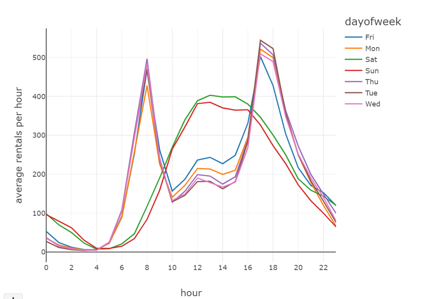

**Bike Sharing Prediction**

The data is about the bike-sharing program and was hosted in Kaggle.

The data is hourly rental data spanning two years. The training set
contains of the first 19 days of each month, while the test set is the
20th to the end of the month. One must predict the total count of bikes
rented during each hour covered by the test set, using only information
available prior to the rental period.

**About Dataset**
-----------------

Overview Bike sharing systems are a means of renting bicycles where the
process of obtaining membership, rental, and bike return is automated
via a network of kiosk locations throughout a city. Using these systems,
people are able rent a bike from a one location and return it to a
different place on an as-needed basis. Currently, there are over 500
bike-sharing programs around the world.

**This notebook explains how we can go about explore and prepare data for model building. The notebook is structured in the following way**
-------------------------------------------------------------------------------------------------------------------------------------------

About Dataset

Data Summary

Feature Engineering

Missing Value Analysis

Outlier Analysis

Correlation Analysis

Visualizing Distribution Of Data

Visualizing Count Vs (Month,Season,Hour,Weekday,Usertype)

Filling 0\'s In Windspeed Using Random Forest

Linear Regression Model

Regularization Models

Ensemble Models

**Attribute Information:**

datetime - hourly date + timestamp

season - 1 = spring, 2 = summer, 3 = fall, 4 = winter

holiday - whether the day is considered a holiday

workingday - whether the day is neither a weekend nor holiday

weather - 1: Clear, Few clouds, Partly cloudy, Partly cloudy 2: Mist +
Cloudy, Mist + Broken clouds, Mist + Few clouds, Mist 3: Light Snow,
Light Rain + Thunderstorm + Scattered clouds, Light Rain + Scattered
clouds 4: Heavy Rain + Ice Pallets + Thunderstorm + Mist, Snow + Fog

temp - temperature in Celsius

atemp - \"feels like\" temperature in Celsius

humidity - relative humidity

windspeed - wind speed

casual - number of non-registered user rentals initiated

registered - number of registered user rentals initiated

count - number of total rentals

#### **Feature Engineering:**

As we see from the above results, the columns \"season\", \"holiday\",
\"workingday\" and \"weather\" should be of \"categorical\" data
type.But the current data type is \"int\" for those columns. Let us
transform the dataset in the following ways so that we can get started
up with our EDA

Create new columns \"date,\"hour\",\"weekDay\",\"month\" from
\"datetime\" column. Coerce the datatype of
\"season\",\"holiday\",\"workingday\" and weather to category. Drop the
datetime column as we already extracted useful features from it.
Creating New Columns From \"Datetime\" Column

{width="3.95370406824147in"
height="1.8184514435695538in"}

#### **Missing Values Analysis**

Once we get hang of the data and columns, next step we geneally is to
find out whether we have any missing values in our data. Luckily we dont
have any missing value in the dataset. One way which I generally prefer
to visualize missing value in the dataset is through \"missingno\".

#### **Outliers Analysis**

At first look, \"count\" variable contains lot of outlier data points
which skews the distribution towards right (as there are more data
points beyond Outer Quartile Limit).But in addition to that, following
inferences can also been made from the simple boxplots given below.

Spring season has got relatively lower count.The dip in median value in
boxplot gives evidence for it. The boxplot with \"Hour Of The Day\" is
quiet interesting.The median value are relatively higher at 7AM - 8AM
and 5PM - 6PM. It can be attributed to regular school and office users
at that time. Most of the outlier points are mainly contributed from
\"Working Day\" than \"Non Working Day\". It is quiet visible from from
figure 4.

{width="3.2698042432195975in"
height="2.6944444444444446in"}

#### **Correlation Analysis**

One common to understand how a dependent variable is influenced by
features (numerical) is to fibd a correlation matrix between them. Lets
plot a correlation plot between \"count\" and
\[\"temp\",\"atemp\",\"humidity\",\"windspeed\"\].

temp and humidity features has got positive and negative correlation
with count respectively.Although the correlation between them are not
very prominent still the count variable has got little dependency on
\"temp\" and \"humidity\". windspeed is not gonna be really useful
numerical feature and it is visible from it correlation value with
\"count\" \"atemp\" is variable is not taken into since \"atemp\" and
\"temp\" has got strong correlation with each other. During model
building any one of the variable has to be dropped since they will
exhibit multicollinearity in the data. \"Casual\" and \"Registered\" are
also not taken into account since they are leakage variables in nature
and need to dropped during model building. Regression plot in seaborn is
one useful way to depict the relationship between two features. Here we
consider \"count\" vs \"temp\", \"humidity\", \"windspeed\".

{width="3.520213254593176in"
height="2.9583333333333335in"}

#### **Visualizing Distribution Of Data**

As it is visible from the below figures that \"count\" variable is
skewed towards right. It is desirable to have Normal distribution as
most of the machine learning techniques require dependent variable to be
Normal. One possible solution is to take log transformation on \"count\"
variable after removing outlier data points. After the transformation
the data looks lot better but still not ideally following normal
distribution.

{width="3.4444444444444446in"
height="1.5036329833770778in"}

{width="3.1157403762029747in"
height="2.6064370078740158in"}

#### **Visualizing Count Vs (Month,Season,Hour,Weekday,Usertype) **

It is quiet obvious that people tend to rent bike during summer season
since it is really conducive to ride bike at that season.Therefore June,
July and August has got relatively higher demand for bicycle. On
weekdays more people tend to rent bicycle around 7AM-8AM and 5PM-6PM. As
we mentioned earlier this can be attributed to regular school and office
commuters. Above pattern is not observed on \"Saturday\" and
\"Sunday\".More people tend to rent bicycle between 10AM and 4PM. The
peak user count around 7AM-8AM and 5PM-6PM is purely contributed by
registered user.

Visualizing Count Vs (Month,Season,Hour,Weekday,Usertype) It is quiet
obvious that people tend to rent bike during summer season since it is
really conducive to ride bike at that season.Therefore June, July and
August has got relatively higher demand for bicycle. On weekdays more
people tend to rent bicycle around 7AM-8AM and 5PM-6PM. As we mentioned
earlier this can be attributed to regular school and office commuters.
Above pattern is not observed on \"Saturday\" and \"Sunday\".More people
tend to rent bicycle between 10AM and 4PM. The peak user count around
7AM-8AM and 5PM-6PM is purely contributed by registered user.

{width="4.08878280839895in"
height="6.458333333333333in"}

**Regularized Ridge and Lasso:**

Please look through the notebook for implementation of ML models. Linear
regression, Random forest and Gradient Boosting are implemented.

References:

 [[https://www.kaggle.com/viveksrinivasan/eda-ensemble-model-top-10-percentile]{.underline}](https://www.kaggle.com/viveksrinivasan/eda-ensemble-model-top-10-percentile)

